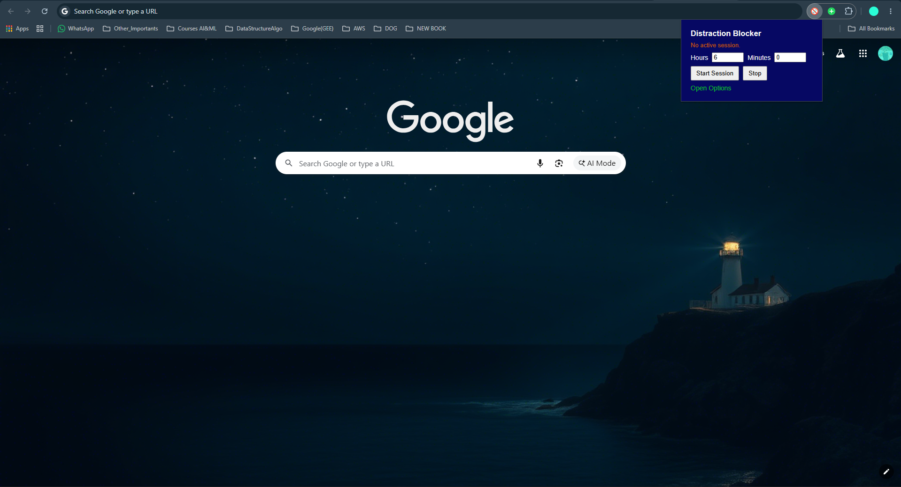
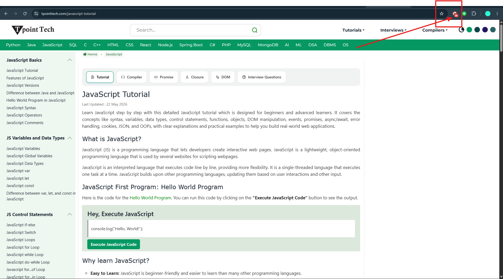
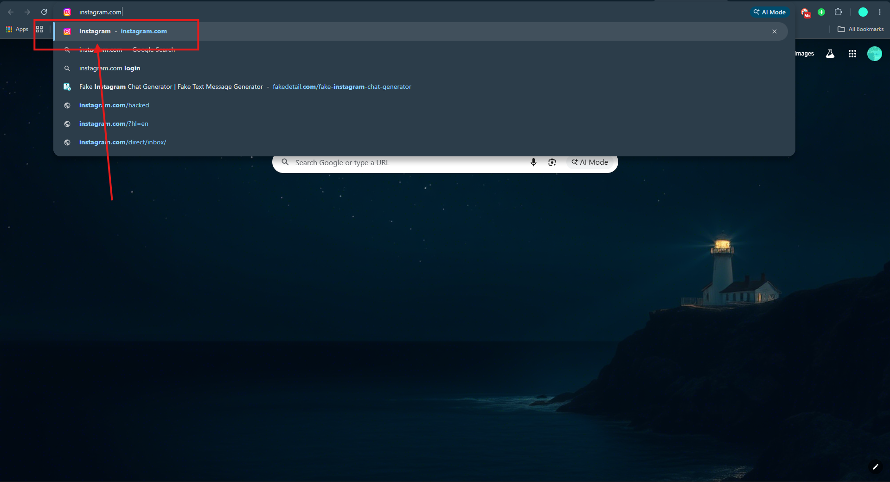
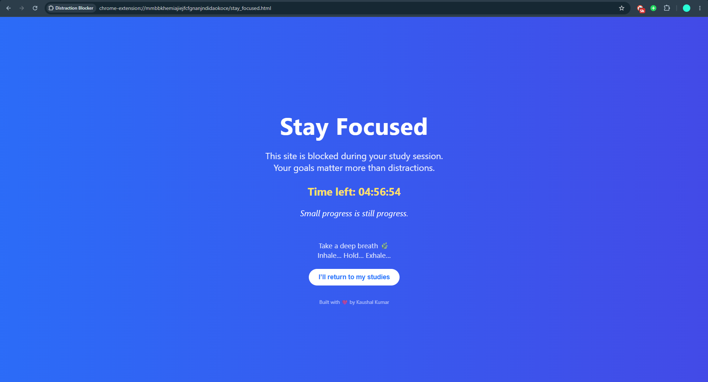
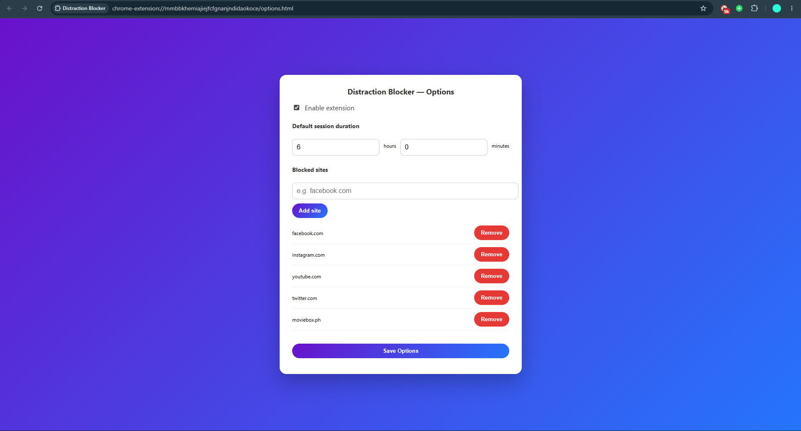

# 🚀 Stay Focused – Distraction Blocker Chrome Extension

<p align="center">
  
</p>

<p align="center">


</p>

---

# 🎯 Project Overview

**Stay Focused** is a productivity-focused Chrome Extension designed to help students, developers, and professionals eliminate digital distractions during study or work sessions.

The extension temporarily blocks distracting websites such as:

📱 Instagram
📺 YouTube
📘 Facebook
🐦 Twitter/X
🌐 Any custom website added by the user

Instead of allowing access, the extension redirects users to a motivational focus page that reinforces productive behavior and helps maintain concentration.


<p align="center">
  
</p>

---

# 🧠 Problem Statement

Modern students and professionals lose valuable hours every day due to social media and entertainment websites.

Common issues include:

❌ Constant Instagram scrolling

❌ YouTube rabbit holes

❌ Frequent social media checking

❌ Reduced productivity

❌ Poor study habits

### Solution

Stay Focused creates a distraction-free environment by temporarily blocking selected websites during active study sessions.

---

# ✨ Key Features

## ⏱️ Smart Focus Sessions

* Set custom study duration
* Start productivity sessions instantly
* Stop sessions anytime
* Real-time countdown timer

---

## 🚫 Website Blocking

Block:

* Instagram
* Facebook
* YouTube
* Twitter/X
* Custom websites

Users can easily add or remove domains.

---

## ⚙️ Custom Settings Dashboard

### Features

✅ Enable/Disable Extension

✅ Add Blocked Websites

✅ Remove Websites

✅ Configure Session Duration

✅ Save Preferences

---

## 💡 Motivational Focus Screen

Instead of showing:

> Access Denied

The extension displays:

🎯 Stay Focused

📈 Small progress is still progress

⏳ Remaining study time

❤️ Motivational reminders

This creates a more positive productivity experience.

---

# 🏗️ System Workflow

```text
User Starts Session
         │
         ▼
Timer Activated
         │
         ▼
Website Request Detected
         │
         ▼
Check Blocked Site List
         │
 ┌───────┴────────┐
 │                │
 ▼                ▼
Blocked        Allowed
 │                │
 ▼                ▼
Redirect      Open Website
to Focus Page
```

---

# 📸 Screenshots

## 🔹 Extension Popup

Manage focus sessions directly from the browser toolbar.



---

## 🔹 Website Blocking in Action

Blocked websites automatically redirect to the motivational focus page.



---

## 🔹 Settings Dashboard

Customize blocked websites and study duration.



---

# 🛠️ Technology Stack

| Technology            | Purpose                |
| --------------------- | ---------------------- |
| 🟠 HTML5              | Structure              |
| 🔵 CSS3               | Styling                |
| 🟡 JavaScript         | Logic                  |
| 🟢 Chrome APIs        | Browser Integration    |
| 💾 Chrome Storage API | User Preferences       |
| ⚡ Manifest V3         | Extension Architecture |

---

# 📂 Project Structure

```text
Distraction-Blocker/
│
├── manifest.json
│
├── popup/
│   ├── popup.html
│   ├── popup.css
│   └── popup.js
│
├── options/
│   ├── options.html
│   ├── options.css
│   └── options.js
│
├── background/
│   └── background.js
│
├── pages/
│   ├── stay_focused.html
│   ├── stay_focused.css
│   └── stay_focused.js
│
├── images/
│   ├── popup.png
│   ├── block-page.png
│   └── settings-page.png
│
└── README.md
```

---

# 📊 Key Insights

## 📌 Insight 1: Digital Distraction Is a Major Productivity Killer

Most users lose significant study time due to social media interruptions.

### Impact

The extension minimizes unnecessary context switching.

---

## 📌 Insight 2: Positive Reinforcement Works Better

Rather than displaying a harsh "Blocked" message, the extension encourages users with motivational content.

### Result

Improved user experience and reduced frustration.

---

## 📌 Insight 3: Customizability Improves Adoption

Users can define their own blocked websites.

### Benefit

The extension adapts to different work and study habits.

---

## 📌 Insight 4: Time-Based Blocking Creates Accountability

The countdown timer helps users remain committed to their focus session.

### Benefit

Supports:

* Deep Work
* Exam Preparation
* Coding Sessions
* Reading Sessions

---

## 📌 Insight 5: Simple UI Encourages Daily Usage

The clean and lightweight design makes the extension easy to use without a learning curve.

---

# 🚀 Future Enhancements

### Productivity Features

* 🍅 Pomodoro Timer
* 📊 Daily Analytics Dashboard
* 🔥 Focus Streak Tracking
* 📈 Productivity Reports

### User Experience

* 🌙 Dark Mode
* 🎨 Theme Customization
* 🔔 Desktop Notifications
* 📱 Mobile Companion App

### Advanced Features

* ☁️ Cloud Sync
* 🤖 AI Productivity Coach
* 📉 Distraction Analytics
* 🏆 Achievement System

---

# 🎓 Learning Outcomes

Through this project I gained hands-on experience with:

* Chrome Extension Development
* Manifest V3
* Browser APIs
* Local Storage Management
* Event Handling
* DOM Manipulation
* UI/UX Design
* Productivity Product Development

---

# 👨‍💻 Author

## Kaushal Kumar

💻 Software Developer

🌐 Web Developer

📚 Lifelong Learner

🎯 Building tools that improve productivity and user experience.

---

## ⭐ Support

If you found this project useful:

🌟 Star this repository

🍴 Fork it

🛠️ Contribute improvements

📢 Share feedback

Your support is appreciated!
